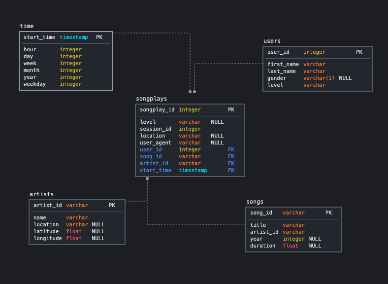

# Project: Data Warehouse
## 1. Introduction and Project Description
A music streaming startup, Sparkify, has grown their user base and song database and want to move their processes and data onto the cloud. Their data resides in S3, in a directory of JSON logs on user activity on the app, as well as a directory with JSON metadata on the songs in their app.

As their data engineer, you are tasked with building an ETL pipeline that extracts their data from S3, stages them in Redshift, and transforms data into a set of dimensional tables for their analytics team to continue finding insights in what songs their users are listening to. You'll be able to test your database and ETL pipeline by running queries given to you by the analytics team from Sparkify and compare your results with their expected results.

In this project, you'll apply what you've learned on data warehouses and AWS to build an ETL pipeline for a database hosted on Redshift. To complete the project, you will need to load data from S3 to staging tables on Redshift and execute SQL statements that create the analytics tables from these staging tables.

## 2. Project Datasets
You'll be working with two datasets that reside in S3. Here are the S3 links for each:

* Song data: `s3://udacity-dend/song_data`
* Log data: `s3://udacity-dend/log_data`  

Log data json path: `s3://udacity-dend/log_json_path.json`

### Song Dataset
The first dataset is a subset of real data from the [Million Song Dataset](https://labrosa.ee.columbia.edu/millionsong/). Each file is in JSON format and contains metadata about a song and the artist of that song. The files are partitioned by the first three letters of each song's track ID. For example, here are filepaths to two files in this dataset.
```
song_data/A/B/C/TRABCEI128F424C983.json
song_data/A/A/B/TRAABJL12903CDCF1A.json
```
And below is an example of what a single song file, TRAABJL12903CDCF1A.json, looks like.
```
{"num_songs": 1, "artist_id": "ARJIE2Y1187B994AB7", "artist_latitude": null, "artist_longitude": null, "artist_location": "", "artist_name": "Line Renaud", "song_id": "SOUPIRU12A6D4FA1E1", "title": "Der Kleine Dompfaff", "duration": 152.92036, "year": 0}
```

### Log Dataset
The second dataset consists of log files in JSON format generated by this event simulator based on the songs in the dataset above. These simulate app activity logs from an imaginary music streaming app based on configuration settings.

The log files in the dataset you'll be working with are partitioned by year and month. For example, here are filepaths to two files in this dataset.
```
log_data/2018/11/2018-11-12-events.json
log_data/2018/11/2018-11-13-events.json
```
And below is an example of what the data in a log file, 2018-11-12-events.json, looks like.


## 3. ETL Pipeline

### Directory Structure
```
├── CreateRedshiftCluster.ipynb
├── README.md
├── create_tables.py
├── dwh.cfg
├── etl.py
├── img
│   ├── log-data.png
│   └── schema.png
└── sql_queries.py
```
* `CreateRedshiftCluster.ipynb` is a Jupyter notebook based off of the Infrastructure-as-code exercise from the lesson. It allows us to create the Redshift cluster, see its status, run analytical queries to verify our ETL, and clean up cluster resources.  
* `README.md` is where you'll provide discussion on your process and decisions for this ETL pipeline.  
* `create_table.py` is where you'll create your fact and dimension tables for the star schema in Redshift.  
* `dwh.cfg` is a config file which contains the AWS Key and Secret, some of the cluster and Redshift parameters, and the S3 bucket locations
* `etl.py` is where you'll load data from S3 into staging tables on Redshift and then process that data into your analytics tables on Redshift.  
* `sql_queries.py` is where you'll define you SQL statements, which will be imported into the two other files above.  


### Instructions
1. Run `CreateRedshiftCluster.ipynb` in order to provision a Redshift cluster with the configs defined in `dwh.cfg` and create clients for IAM, EC2, S3, etc...
2. Run `create_tables.py` to drop and create the fact and dimension tables based on the SQL statements in `sql_queries.py` and then run `etl.py` in order to load data from the json files to the staging tables and insert the data from the staging tables into the final analytic tables based on the SQL statements in `sql_queries.py`
3. Verify that the tables have been created with the required schema and that data has been populated using some of the examples in `CreateRedshiftCluster.ipynb`. Once it looks good, run Step 6 within the notebook to clean up the cluster resources.

### Schema
We create a star schema optimized for song play analysis where `songplays` is the fact table and the remaining tables are dimension tables as seen in this schema diagram. The distkeys and sortkeys are set in `sql_queries.py`



#### Fact Table
1. **songplays** - records in event data associated with song plays i.e. records with page `NextSong`
    * *songplay_id, start_time, user_id, level, song_id, artist_id, session_id, location, user_agent*
#### Dimension Tables
2. **users** - users in the app
    * *user_id, first_name, last_name, gender, level*
3. **songs** - songs in music database
    * *song_id, title, artist_id, year, duration*
4. **artists** - artists in music database
    * *artist_id, name, location, lattitude, longitude*
5. **time** - timestamps of records in songplays broken down into specific units
    * *start_time, hour, day, week, month, year, weekday*
