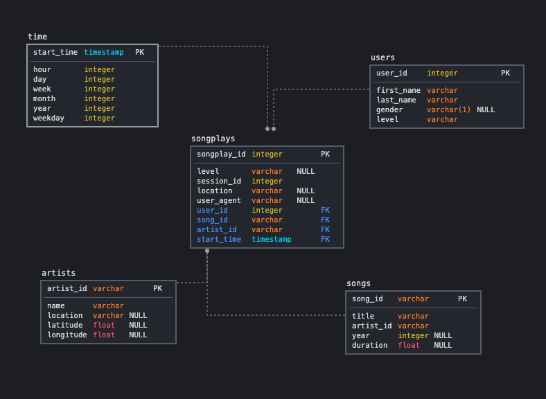

# Project: Data Lake

## 1. Introduction and Project Description
A music streaming startup, Sparkify, has grown their user base and song database even more and want to move their data warehouse to a data lake. Their data resides in S3, in a directory of JSON logs on user activity on the app, as well as a directory with JSON metadata on the songs in their app.

As their data engineer, you are tasked with building an ETL pipeline that extracts their data from S3, processes them using Spark, and loads the data back into S3 as a set of dimensional tables. This will allow their analytics team to continue finding insights in what songs their users are listening to. You'll be able to test your database and ETL pipeline by running queries given to you by the analytics team from Sparkify and compare your results with their expected results.

In this project, you'll apply what you've learned on Spark and data lakes to build an ETL pipeline for a data lake hosted on S3. To complete the project, you will need to load data from S3, process the data into analytics tables using Spark, and load them back into S3. You'll deploy this Spark process on a cluster using AWS.

## 2. Project Datasets
You'll be working with two datasets that reside in S3. Here are the S3 links for each:

* Song data: `s3://udacity-dend/song_data`
* Log data: `s3://udacity-dend/log_data`  

### Song Dataset
The first dataset is a subset of real data from the [Million Song Dataset](https://labrosa.ee.columbia.edu/millionsong/). Each file is in JSON format and contains metadata about a song and the artist of that song. The files are partitioned by the first three letters of each song's track ID. For example, here are filepaths to two files in this dataset.
```
song_data/A/B/C/TRABCEI128F424C983.json
song_data/A/A/B/TRAABJL12903CDCF1A.json
```
And below is an example of what a single song file, TRAABJL12903CDCF1A.json, looks like.
```
{"num_songs": 1, "artist_id": "ARJIE2Y1187B994AB7", "artist_latitude": null, "artist_longitude": null, "artist_location": "", "artist_name": "Line Renaud", "song_id": "SOUPIRU12A6D4FA1E1", "title": "Der Kleine Dompfaff", "duration": 152.92036, "year": 0}
```

### Log Dataset
The second dataset consists of log files in JSON format generated by this event simulator based on the songs in the dataset above. These simulate app activity logs from an imaginary music streaming app based on configuration settings.

The log files in the dataset you'll be working with are partitioned by year and month. For example, here are filepaths to two files in this dataset.
```
log_data/2018/11/2018-11-12-events.json
log_data/2018/11/2018-11-13-events.json
```
And below is an example of what the data in a log file, 2018-11-12-events.json, looks like.


## 3. Database Schema Design
### Schema
Similar to the previous projects, we create a star schema optimized for song play analysis where `songplays` is the fact table and the remaining tables are dimension tables as seen in this schema diagram. The input tables are located in an S3 bucket as json files and the output tables The output tables are written in parquet format to an S3 bucket as well. Their locations are respectively:
```
input_data = "s3a://udacity-dend/"
output_data = "s3a://udacity-sparkify-jonchang03/"
```
Note: The output S3 bucket would need to be recreated in order to replicate the ETL steps described below.



#### Fact Table
1. **songplays** - records in event data associated with song plays i.e. records with page `NextSong`
    * *songplay_id, start_time, user_id, level, song_id, artist_id, session_id, location, user_agent*
#### Dimension Tables
2. **users** - users in the app
    * *user_id, first_name, last_name, gender, level*
3. **songs** - songs in music database
    * *song_id, title, artist_id, year, duration*
4. **artists** - artists in music database
    * *artist_id, name, location, lattitude, longitude*
5. **time** - timestamps of records in songplays broken down into specific units
    * *start_time, hour, day, week, month, year, weekday*

## 4. ETL Pipeline
Along with the lectures from Lesson 3, the following [tutorial](https://docs.aws.amazon.com/emr/latest/ManagementGuide/emr-gs.html) in the AWS Docs was helpful for getting started with Amazon EMR. For me, the steps were as follows:
1. Set up Amazon EMR cluster
    * Create an SSH key pair in EC2 to be used for creating the Amazon EMR cluster
    * Create an Amazon EMR cluster using the `Create Cluster - Quick Options` page. Remember to choose the Spark applications, and an appopriate release (e.g. after 5.25.0, a web proxy is no longer needed to access Spark history server UI from the console), and appropriate instance types (I just stuck with the defaults of m5.xlarge and 3 instances with 1 master and 2 core nodes). You will be able to use the EC2 key pair that you just created.
    * Allow SSH access to the master node (you will need to modify the security group rules for the master node to allow SSH traffic from your IP address) You can test this by the following: `ssh hadoop@ec2-###-##-##-###.compute-1.amazonaws.com -i ~/mykeypair.pem` and may need to also run `chmod 400 ~/mykeypair.pem` where `mykeypair.pem` is the download from the SSH key pair setup. 
2. Move your spark scripts onto the master node. I did this by ssh'ing into the master node, and the doing an install of git via `sudo yum install git` and pulling my project repository files.
3. Execute the spark scripts via spark-submit (feel free to specify more options such as driver memory or number of executors, etc...). I just ran the following: `/usr/bin/spark-submit --master yarn etl.py`


