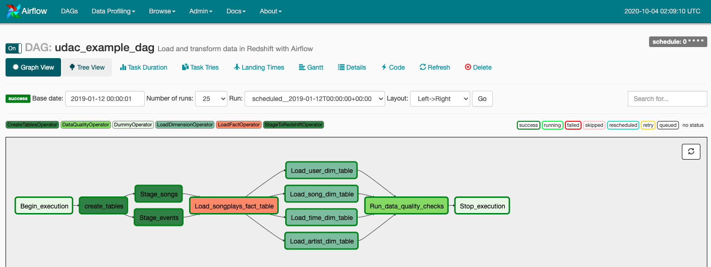

# Project: Data Pipelines with Airflow
## 1. Introduction and Project Description
A music streaming company, Sparkify, has decided that it is time to introduce more automation and monitoring to their data warehouse ETL pipelines and come to the conclusion that the best tool to achieve this is Apache Airflow.

They have decided to bring you into the project and expect you to create high grade data pipelines that are dynamic and built from reusable tasks, can be monitored, and allow easy backfills. They have also noted that the data quality plays a big part when analyses are executed on top the data warehouse and want to run tests against their datasets after the ETL steps have been executed to catch any discrepancies in the datasets.

The source data resides in S3 and needs to be processed in Sparkify's data warehouse in Amazon Redshift. The source datasets consist of JSON logs that tell about user activity in the application and JSON metadata about the songs the users listen to.


## 2. Project Datasets
You'll be working with two datasets that reside in S3. Here are the S3 links for each:

* Song data: `s3://udacity-dend/song_data`
* Log data: `s3://udacity-dend/log_data`  

Log data json path: `s3://udacity-dend/log_json_path.json`

### Song Dataset
The first dataset is a subset of real data from the [Million Song Dataset](https://labrosa.ee.columbia.edu/millionsong/). Each file is in JSON format and contains metadata about a song and the artist of that song. The files are partitioned by the first three letters of each song's track ID. For example, here are filepaths to two files in this dataset.
```
song_data/A/B/C/TRABCEI128F424C983.json
song_data/A/A/B/TRAABJL12903CDCF1A.json
```
And below is an example of what a single song file, TRAABJL12903CDCF1A.json, looks like.
```
{"num_songs": 1, "artist_id": "ARJIE2Y1187B994AB7", "artist_latitude": null, "artist_longitude": null, "artist_location": "", "artist_name": "Line Renaud", "song_id": "SOUPIRU12A6D4FA1E1", "title": "Der Kleine Dompfaff", "duration": 152.92036, "year": 0}
```

### Log Dataset
The second dataset consists of log files in JSON format generated by this event simulator based on the songs in the dataset above. These simulate app activity logs from an imaginary music streaming app based on configuration settings.

The log files in the dataset you'll be working with are partitioned by year and month. For example, here are filepaths to two files in this dataset.
```
log_data/2018/11/2018-11-12-events.json
log_data/2018/11/2018-11-13-events.json
```
And below is an example of what the data in a log file, 2018-11-12-events.json, looks like.


## 3. ETL Pipeline

### Directory Structure
```
├── README.md
├── create_tables.sql
├── dags
│   ├── __init__.py
│   └── udac_example_dag.py
├── img
│   ├── dag.png
│   └── log-data.png
└── plugins
    ├── __init__.py
    ├── helpers
    │   ├── __init__.py
    │   └── sql_queries.py
    └── operators
        ├── __init__.py
        ├── create_tables.py
        ├── data_quality.py
        ├── load_dimension.py
        ├── load_fact.py
        └── stage_redshift.py
```
Some key scripts include:
* `create_tables.sql` - contains the SQL statements that creates the staging, fact, and dimension tables (if they don't already exist) utilized by the rest of the ETL process
* `dags/udac_example_dag.py` - our DAG which contains all the necessary tasks to complete our ETL process. The default parameters are specified by the project requirements.
    * The DAG does not have dependencies on past runs
    * On failure, the task are retried 3 times
    * Retries happen every 5 minutes
    * Catchup is turned off
    * Do not email on retry
* `plugins/helpers/sql_queries.py` - contains the SQL queries that select data from the staging table, and was modified to perform insertions for the loading operators
* `plugins/operators/create_tables.py` - operator that creates the tables if they don't already exist
* `plugins/operators/stage_redshift.py`- operator that copies the JSON files into the staging tables in Redshift
* `plugins/operators/load_fact.py` - operator that loads data from the staging tables into the fact tables
* `plugins/operators/load_dimension.py` - operator that loads data from staging tables into the dimension tables
* `plugins/operators/data_quality.py` - operator that checks the data quality (I just utilized the sample operator from the lesson which ensures that the tables are populated.)
Note: The various `__init__.py` scripts needed to be modified to include all the appropriate operators.


### Instructions
1. First, we can utilize our IaaC script (or [notebook](https://github.com/jonchang03/udacity-data-engineering/blob/master/02_cloud_data_warehouses/p3_data_warehouse/CreateRedshiftCluster.ipynb) in my case) to spin up a Redshift cluster.
2. After finalizing our ETL, we go to our workspace, and run `/opt/airflow/start.sh` in order to start the Airflow webserver. Once the Airflow webserver is ready, we go to the Airflow UI.
3. Within the Airflow UI, we add connections that we will be using for AWS and to connect to redshift, `aws_credentials` which utilizes our IAM User access key id and key, and the details of our Postgres database in Redshift which we created in step 1.
4. Now, we can turn on our dag, and watch it run! If we go to the graph view, we will see something like this:


### Schema
We create a star schema optimized for song play analysis where `songplays` is the fact table and the remaining tables are dimension tables. This is the same as in projects 3 and 4.

#### Fact Table
1. **songplays** - records in event data associated with song plays i.e. records with page `NextSong`
    * *songplay_id, start_time, user_id, level, song_id, artist_id, session_id, location, user_agent*
#### Dimension Tables
2. **users** - users in the app
    * *user_id, first_name, last_name, gender, level*
3. **songs** - songs in music database
    * *song_id, title, artist_id, year, duration*
4. **artists** - artists in music database
    * *artist_id, name, location, lattitude, longitude*
5. **time** - timestamps of records in songplays broken down into specific units
    * *start_time, hour, day, week, month, year, weekday*
