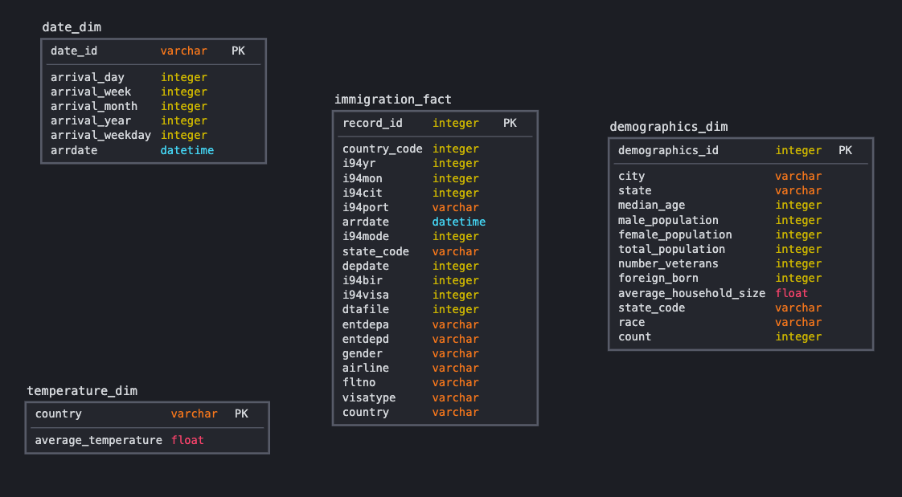

###Data Engineering Capstone Project

More details can be found in `Capstone Project Template.ipynb` and the ETL process can be run using `python etl.py`.

### Project Summary
The goal of this project is to create an ETL pipeline that ingests I94 immigration data along with supplementary datasets on temperature, US demographics, and airport codes, cleans the data, and loads it into fact and dimension tables to allow for analytical queries (e.g. SQL). We could then ask questions related to trends in immigration and understand. 

The project follows the follow steps:
* Step 1: Scope the Project and Gather Data
* Step 2: Explore and Assess the Data
* Step 3: Define the Data Model
* Step 4: Run ETL to Model the Data
* Step 5: Complete Project Write Up

### Step 1: Scope the Project and Gather Data

#### Scope 
*Explain what you plan to do in the project in more detail. What data do you use? What is your end solution look like? What tools did you use?*
* Project description: In this project, I plan to create an analytics database that will make it easy to query information around US immigration trends such as the temperature or demographic differences between source and destination countries.

* Data Used: I used the data from the Udacity provided project which includes immigration, temperature, demographic, and airport data.
* End Solution: I intend to create an ETL pipeline that will load the provided data from sources to staging tables before procesing and cleaning it into fact and dimension tables that can be easily queried via Python. An application layer could even be built on top of of this backend data warehouse. 

* Tools Used: Python - Pandas and PySpark

#### Describe and Gather Data 
*Describe the data sets you're using. Where did it come from? What type of information is included?*

* **I94 Immigration Data:**  This data comes from the US National Tourism and Trade Office. A data dictionary is included in the workspace. [This](https://travel.trade.gov/research/reports/i94/historical/2016.html) is where the data comes from.
* **World Temperature Data:** This dataset came from Kaggle and contains various temperature reports from cities. You can read more about it [here](https://www.kaggle.com/berkeleyearth/climate-change-earth-surface-temperature-data).
* **U.S. City Demographic Data:** This data comes from [Opendatasoft](https://public.opendatasoft.com/explore/dataset/us-cities-demographics/export/) and contains information about the demographics of all US cities and census-designated places with a population greater than or equal to 65,000 from a 2015 Survey.
* **Airport Code Table:** This is a simple table of airport codes and corresponding cities. It comes from [here](https://datahub.io/core/airport-codes#data).

### Step 2: Explore and Assess the Data
#### Explore the Data 
Identify data quality issues, like missing values, duplicate data, etc.  
*In the plots below we can see the columns for each of the dataframes and the percentage of missing data. We decided to exclude airport data from our project.*
#### Cleaning Steps
Document steps necessary to clean the data

Based on the EDA below, we take the following data cleaning steps:
* df_immigration:
    * drop `occup`, `entdepu`, `insnum` which are mostly missing values
    * replace null values for `i94addr` with '99' for 'All Other Codes'
* df_demographics
    * drop records with missing values for `Male Population`, `Female Population`, `Number of Veterans`, `Foreign-born`, `Average Household Size`
* df_temperature
    * drop records with missing values for `AverageTemperature` 

### Step 3: Define the Data Model
#### 3.1 Conceptual Data Model
Map out the conceptual data model and explain why you chose that mode

We chose to use a star schema which is optimized for analysis on immigration events from the I94 dataset. We have the `immigration_fact` as the fact table and `demographics_dim`, `date_dim`, and `temperature_dim` as the dimension tables. This would allow end-users such as business analysts easily run queries around the correlations between immigration patterns and temperature or demographics.

#### 3.2 Mapping Out Data Pipelines
List the steps necessary to pipeline the data into the chosen data model
1. Load the datasets into Spark
2. Perform data cleaning steps previously listed for immigration, temperature, and demographics datasets
3. Create tables
    * immigration_fact table
    * date_dim table (based on arrival date)
    * temperature_dim table (average temperature for each country)
    * demographics_dim table

### Step 4: Run Pipelines to Model the Data 
#### 4.1 Create the data model
Build the data pipelines to create the data model.

#### 4.2 Data Quality Checks
Explain the data quality checks you'll perform to ensure the pipeline ran as expected. These could include:
 * Integrity constraints on the relational database (e.g., unique key, data type, etc.)
 * Unit tests for the scripts to ensure they are doing the right thing
 * Source/Count checks to ensure completeness
 
Run Quality Checks  
For each table, check for:
1. records exist
2. no duplicate records

#### 4.3 Data dictionary 
Create a data dictionary for your data model. For each field, provide a brief description of what the data is and where it came from. You can include the data dictionary in the notebook or in a separate file.

#### 1. Immigration Fact Table
From the I94 Immigration Dataset with immigration events.

| Column       | Description                                                                           |
|--------------|---------------------------------------------------------------------------------------|
| record_id    | Unique ID for a given record                                                          |
| country_code | 3 digit code for immigrant country of residence                                       |
| i94yr        | 4 digit year                                                                          |
| i94mon       | Numeric month                                                                         |
| i94cit       | 3 digit code for immigrant country of birth                                           |
| i94port      | Port of admission                                                                     |
| arrdate      | Arrival date in the USA                                                               |
| i94mode      | Mode of transportation (1 = Air; 2 = Sea; 3 = Land; 9 = Not reported)                 |
| state_code   | State of arrival in the USA                                                           |
| depdate      | Departure Date from the USA.                                                          |
| i94bir       | Age of Respondent in Years                                                            |
| i94visa      | Visa codes collapsed into three categories: (1 = Business; 2 = Pleasure; 3 = Student) |
| dtadfile     | Character Date Field - Date added to I-94 Files                                       |
| entdepa      | Arrival Flag - admitted or paroled into the U.S.                                      |
| entdepd      | Departure Flag - Departed, lost I-94 or is deceased                                   |
| gender       | Non-immigrant sex                                                                     |
| airline      | Airline used to arrive in U.S.                                                        |
| fltno        | Flight number of Airline used to arrive in U.S.                                       |
| visatype     | Class of admission legally admitting the non-immigrant to temporarily stay in U.S.    |
| country      | Country of residence                                                                  |

#### 2. Temperature Dimension Table
From the World Temperature Dataset from Kaggle - average temperature aggregated to the monthly level.

| Column              | Description                                           |
|---------------------|-------------------------------------------------------|
| country             | country name                                          |
| average_temperature | mean of recorded temperatures for a country (Celsius) |

#### 3. Date Dimension Table
Arrival dates from the I94 Immigration Dataset.

| Column          | Description        |
|-----------------|--------------------|
| date_id         | unique id          |
| arrival_day     | day of arrival     |
| arrival_week    | week of arrival    |
| arrival_month   | month of arrival   |
| arrival_year    | year of arrival    |
| arrival_weekday | weekday of arrival |
| arrdate         | arrival date       |

#### 4. Demographics Dimension Table
From the OpenSoft demographics dataset.

| Column                 | Description                                  |
|------------------------|----------------------------------------------|
| demographics_id        | unique id                                    |
| city                   | Name of US city                              |
| state                  | Name of US state                             |
| median_age             | Median age of city population                |
| male_population        | Count of male population in the city         |
| female_population      | Count of female population in the city       |
| total_population       | Count of total population in the city        |
| number_veterans        | Count of veterans in the city                |
| foreign_born           | Count of foreign born population in the city |
| average_household_size | Average household size in the city           |
| state_code             | State code (abbreviation)                    |
| race                   | Race                                         |
| count                  | Count of individuals by race                 |

### Step 5: Complete Project Write Up
* *Clearly state the rationale for the choice of tools and technologies for the project.*
    * **We used Python scripts to create functions for our EDA and initial preprocessing via robust libraries such as matplotlib and pandas.** 
    * **We utilized Apache Spark due to its ability to handle large amounts of data quickly and efficiently and provides APIs that allows for us to perform analytics, especially on the immigration dataset.**
    * **As we did in the previous projects, we could also utilize Apache Airflow for scheduling and orchestrating our ETL workflow and Amazon Redshift to store our analytics data warehouse.** 
* *Propose how often the data should be updated and why.* **The data should be updated once a month since it seems that the I94 data files are generated monthly based on the listing we previously did.**
* Write a description of how you would approach the problem differently under the following scenarios:
 * *The data was increased by 100x.* **We could use Amazon EMR to scale up our Spark cluster with which we would perform our data preprocessing and Amazon Redshift to store our updated stage, fact, and dimension tables**
 * *The data populates a dashboard that must be updated on a daily basis by 7am every day.* **We could just use Apache Airflow to schedule our pipeline daily via a DAG and add a final task to pull the needed data to the dashboard.**
 * *The database needed to be accessed by 100+ people.* **We would move our database into Amazon Redshift and ensure the concurrency scaling feature is enabled, and possible create roles for different user personas**